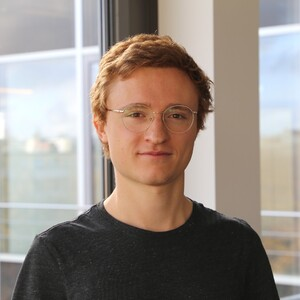
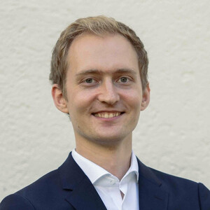

# About OpenPV
We are a team of open source software developers and data engineers based in Germany. We spezialize in building applications based on open geodata. Explore our work at [openpv.de](https://openpv.de).  

- {width="300"}
  Martin Grosshauser - *Data Engineer*
- [
  Florian Kotthoff - *Web Developer*](https://kotthoff.dev){:target="_blank"}
- [
  Konrad Heidler - *Web Developer & Data Engineer*](https://konrad.heidler.info){:target="_blank"}
- [
  Korbinian Pöppel - *Web Developer & Data Engineer*](https://korbi.ai){:target="_blank"}

 
 
 
# Work with us
Tired of the hassle of working with open data? We simplify the process of transforming and enriching open geodata into comprehensive, user-friendly datasets. Here's what we can provide:

-   __🏠 A unified dataset of 3D Buildings for Germany from the LOD2 data of all 16 states__

    ---
    {width="300"}

-   __🌳 Work in Progress - 3D Vegetation data extracted from Laser Scans for several German states__

    ---

    {width="300"}

If you are interested, reach out to info@openpv.de.

 
 
 
# Recent Blog Posts

