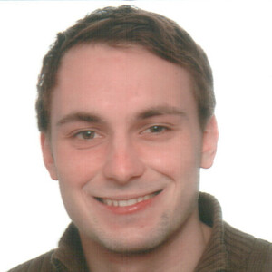

# About OpenPV
We are a team of open source software developers and data engineers based in Germany. We spezialize in building applications based on open geodata. Explore our work at [openpv.de](https://openpv.de).  

-   

    ___

    [Martin Grosshauser - *Data Engineer*](https://muenchen.social/@magro){:target="_blank" :rel="noopener noreferrer"}

-   

    ___

    [Florian Kotthoff - *Software Engineer*](https://kotthoff.dev){:target="_blank" :rel="noopener noreferrer"}

-   

    ___

    [Konrad Heidler - *Software & Data Engineer*](https://konrad.heidler.info){:target="_blank" :rel="noopener noreferrer"}

-   

    ___

    [Korbinian Pöppel - *Software Engineer*](https://korbi.ai){:target="_blank" :rel="noopener noreferrer"}

 
 
 
# Work with us
Tired of the hassle of working with open data? We simplify the process of transforming and enriching open geodata into comprehensive, user-friendly datasets. Here's what we can provide:

-   {width="300"}
    
    ___
    
    __🏠 A unified dataset of 3D Buildings for Germany from the LOD2 data of all 16 states__

    
    

-  {width="300"}

    ___

    __🌳 Work in Progress - 3D Vegetation data extracted from Laser Scans for several German states__

    

If you are interested, reach out to info@openpv.de.

 
 
 
# Recent Blog Posts

