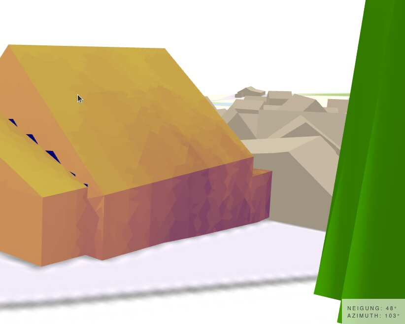

# New feature - displaying azimuth and tilt angle of every 3D building
We have implemented a new feature - at openpv.de the azimuth and tilt angle are now shown in the UI.

<!-- more -->

Knowing the exact tilt and orientation of a roof can be a quite nice for solar‑energy modeling. Now, openpv.de displays these parameters directly on the results page. Just hover over any building to see its roof’s tilt angle and azimuth. You can use these values and feed them into tools like PVGIS for more accurate solar‑potential calculations.

